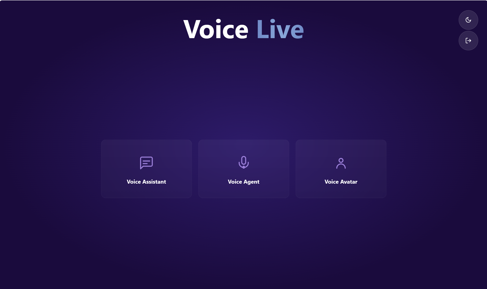
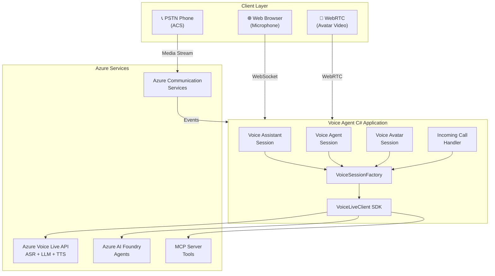
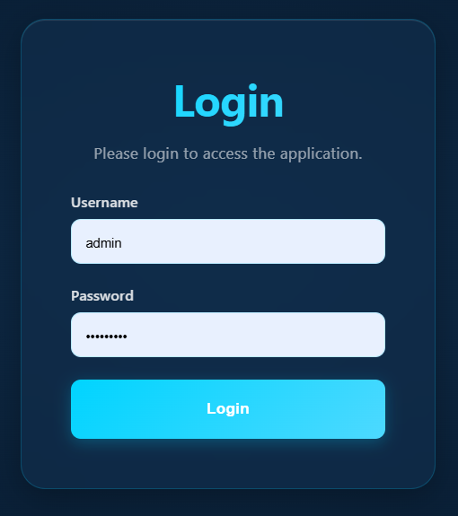
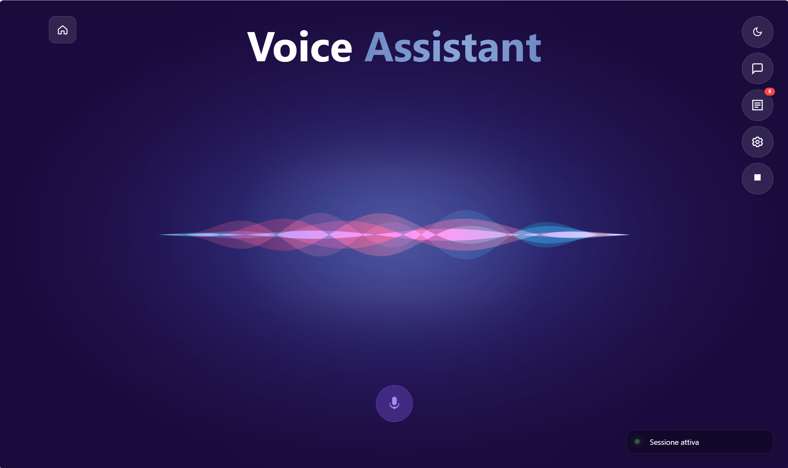
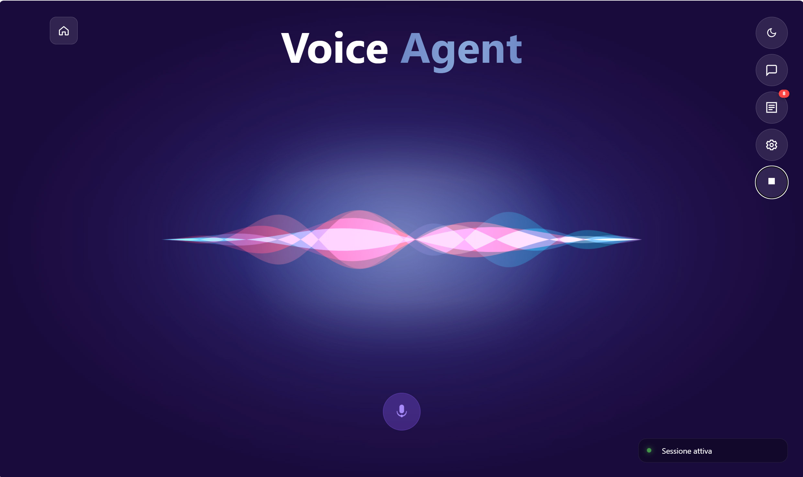
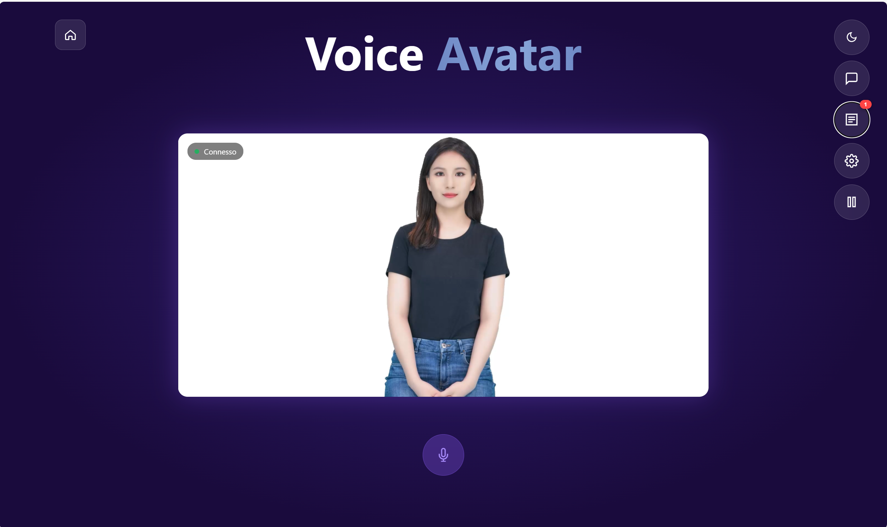

# 🎙️ Voice Agent C#

### Real-Time Voice AI Accelerator

[](https://codespaces.new/congiuluc/voice-agent-csharp)
[](https://vscode.dev/redirect?url=vscode://ms-vscode-remote.remote-containers/cloneInVolume?url=https://github.com/congiuluc/voice-agent-csharp)

[](LICENSE)
[](#)
[](#)
[](#)
[](#)
[](#)

**A lightweight, enterprise-ready template to create speech-to-speech voice agents**  
with natural-sounding voices and seamless telephony integration.



[Quick Start](#-quick-start) • [Features](#-features) • [Architecture](#-architecture) • [Documentation](#-documentation) • [Resources](#-resources)


---

## 📋 Table of Contents

- [Overview](#-overview)
- [Quick Start](#-quick-start)
- [Features](#-features)
- [Screenshots](#-screenshots)
- [Architecture](#-architecture)
- [Session Types](#-session-types)
- [MCP Server](#-mcp-server)
- [.NET Aspire Orchestration](#-net-aspire-orchestration)
- [WebSocket Protocol](#-websocket-protocol)
- [Azure Setup Guides](#-azure-setup-guides)
- [Deployment](#-deployment)
- [Testing](#-testing)
- [Configuration Reference](#-configuration-reference)
- [Project Structure](#-project-structure)
- [Troubleshooting](#-troubleshooting)
- [Resources](#-resources)

---

## 🌟 Overview

**Voice Agent C#** leverages [Azure Voice Live API](https://learn.microsoft.com/azure/ai-services/speech-service/voice-live) and [Azure Communication Services](https://learn.microsoft.com/azure/communication-services/concepts/call-automation/call-automation) to deliver personalized self-service experiences with natural-sounding voices.



> **💡 Key Technologies:**
> - **Azure Voice Live API** — Unified ASR + LLM + TTS for low-latency speech-to-speech
> - **Azure Communication Services** — PSTN telephony integration with real-time event triggers
> - **.NET Aspire** — Local orchestration with service discovery and telemetry

> ⚠️ **Responsibility Notice:** You are responsible for assessing all associated risks and complying with applicable laws. See transparency docs for [Voice Live API](https://learn.microsoft.com/azure/ai-foundry/responsible-ai/speech-service/voice-live/transparency-note) and [ACS](https://learn.microsoft.com/azure/communication-services/concepts/privacy).

---

## 🚀 Quick Start

### Prerequisites

| Tool | Purpose | Install |
|:-----|:--------|:--------|
| [.NET 10 SDK](https://dotnet.microsoft.com/download/dotnet/10.0) | Application runtime | `winget install Microsoft.DotNet.SDK.10` |
| [.NET Aspire workload](https://learn.microsoft.com/dotnet/aspire/fundamentals/setup-tooling) | Local orchestration | `dotnet workload install aspire` |
| [Azure CLI](https://learn.microsoft.com/cli/azure/install-azure-cli) | Azure management | `winget install Microsoft.AzureCLI` |
| [Azure Developer CLI](https://learn.microsoft.com/azure/developer/azure-developer-cli/install-azd) | Deployment | `winget install Microsoft.Azd` |

### Run Locally (with .NET Aspire)

```powershell
# Clone and navigate to the project
git clone https://github.com/congiuluc/voice-agent-csharp.git
cd voice-agent-csharp

# Start all services via Aspire
cd aspire/voice-agent-csharp.AppHost
dotnet run
```

The **Aspire Dashboard** opens automatically at `https://localhost:17122` showing all services, logs, and traces.

### Deploy to Azure

```powershell
azd auth login
azd up
```

---

## ✨ Features

### Core Capabilities

| Feature | Description |
|:--------|:------------|
| 🎙️ **Voice Assistant** | Direct GPT model conversations with customizable instructions |
| 🤖 **Voice Agent** | Azure AI Foundry Agents for managed AI experiences |
| 👤 **Voice Avatar** | Real-time talking avatar with WebRTC video streaming |
| 📞 **ACS Integration** | PSTN phone call handling via Azure Communication Services |
| 🔧 **MCP Tools** | Extensible Model Context Protocol server |
| 🌐 **Web Client** | Browser-based testing with microphone support |
| 🚀 **.NET Aspire** | Service discovery, health checks, and OpenTelemetry |

### Technical Highlights

| Category | Features |
|:---------|:---------|
| **Audio Processing** | Real-time ASR/LLM/TTS, server-side VAD, echo cancellation, noise reduction |
| **Multi-modal** | Audio, text, and video (avatar) support |
| **Integration** | MCP tool calling, native function calls, Foundry Agents |
| **Security** | Managed Identity, login protection, PBKDF2 password hashing |
| **Observability** | Application Insights, Serilog, OpenTelemetry, health endpoints |
| **UI** | Razor Pages, dark/light theme toggle |

### 🔐 Default Credentials

| Field | Value |
|:------|:------|
| Username | `admin` |
| Password | `Pa$$w0rd!` |

<details>
<summary><b>📝 Change Password</b></summary>

**1. Generate a hash:**
```powershell
.\generate-password-hash.ps1 -Password "YourNewPassword"
```

**2. Update `src/appsettings.json`:**
```json
{
  "Security": {
    "Authentication": {
      "Username": "admin",
      "PasswordHash": "YOUR_GENERATED_HASH_HERE"
    }
  }
}
```

Or use environment variables (recommended for production):
- `Security__Authentication__Username`
- `Security__Authentication__PasswordHash`

</details>

---

## 📸 Screenshots

### Login


### Voice Assistant


### Voice Agent


### Voice Avatar


---

## 🏗️ Architecture

```
┌─────────────────────────────────────────────────────────────────────────────┐
│                              Client Layer                                   │
├─────────────────┬─────────────────┬─────────────────────────────────────────┤
│   Web Browser   │  PSTN Phone     │   WebRTC (Avatar)                       │
│   (Microphone)  │  (ACS)          │                                         │
└────────┬────────┴────────┬────────┴────────┬────────────────────────────────┘
         │ WebSocket       │ Media Stream    │ WebRTC
         ▼                 ▼                 ▼
┌─────────────────────────────────────────────────────────────────────────────┐
│                     Voice Agent C# Application                              │
│  ┌──────────────┐  ┌──────────────┐  ┌──────────────┐  ┌────────────────┐  │
│  │   Voice      │  │   Voice      │  │   Voice      │  │ Incoming Call  │  │
│  │   Assistant  │  │   Agent      │  │   Avatar     │  │ Handler (ACS)  │  │
│  └──────┬───────┘  └──────┬───────┘  └──────┬───────┘  └───────┬────────┘  │
│         └─────────────────┴─────────────────┴──────────────────┘           │
│                           VoiceSessionFactory → VoiceLiveClient SDK        │
└────────────────────────────────────────┬────────────────────────────────────┘
                                         │
         ┌───────────────────────────────┼───────────────────────────────┐
         ▼                               ▼                               ▼
┌─────────────────┐       ┌───────────────────────┐       ┌─────────────────┐
│  MCP Server     │       │  Azure Voice Live API │       │ Azure AI Foundry│
│  ├─ Weather     │       │  • Speech Recognition │       │ • Agent Runtime │
│  └─ DateTime    │       │  • GPT Models         │       │ • MCP Tools     │
│                 │       │  • Neural TTS         │       │ • Knowledge Base│
└─────────────────┘       └───────────────────────┘       └─────────────────┘
```

---

## 📡 Session Types

The application supports **four distinct session types**, each optimized for different use cases:

### 1️⃣ Voice Assistant (`/VoiceAssistant`)

Direct GPT model conversations with full customization.

| Feature | Support |
|:--------|:--------|
| Custom model selection | ✅ gpt-4o, gpt-4o-mini, etc. |
| Custom instructions | ✅ System prompt |
| MCP tool integration | ✅ |
| VAD, echo cancellation | ✅ |

**Use Cases:** Customer service chatbots, FAQ assistants, general voice interfaces

<details>
<summary><b>Configuration Example</b></summary>

```json
{
  "AzureVoiceLive": {
    "Model": "gpt-4o-mini",
    "Voice": "en-US-AvaNeural",
    "Locale": "en-US"
  }
}
```
</details>

---

### 2️⃣ Voice Agent (`/VoiceAgent`)

Integration with **Azure AI Foundry Agents** for managed experiences.

| Feature | Support |
|:--------|:--------|
| Foundry Agent integration | ✅ |
| Agent-managed tools | ✅ |
| Project-based selection | ✅ |
| Token-based auth | ✅ |

**Use Cases:** Enterprise voice agents with knowledge bases, multi-turn flows, complex business logic

<details>
<summary><b>Configuration Example</b></summary>

```json
{
  "AzureVoiceLive": {
    "Endpoint": "https://your-foundry.openai.azure.com/",
    "FoundryAgentId": "asst_xxxxx",
    "FoundryProjectName": "your-project"
  }
}
```
</details>

---

### 3️⃣ Voice Avatar (`/VoiceAvatar`)

Real-time talking avatar with **WebRTC video streaming**.

| Feature | Support |
|:--------|:--------|
| WebRTC video | ✅ |
| Multiple characters | ✅ lisa, harry, etc. |
| Configurable styles | ✅ casual-sitting, etc. |
| H.264 codec | ✅ |

**Use Cases:** Virtual assistants, interactive kiosks, accessible interfaces

<details>
<summary><b>Configuration Example</b></summary>

```json
{
  "AzureVoiceLive": {
    "AvatarCharacter": "lisa",
    "AvatarStyle": "casual-sitting",
    "AvatarVideoWidth": 1920,
    "AvatarVideoHeight": 1080,
    "AvatarVideoBitrate": 2000,
    "AvatarCodec": "H264"
  }
}
```
</details>

---

### 4️⃣ ACS Session (Phone Calls)

**Azure Communication Services** integration for PSTN telephony.

| Endpoint | Description |
|:---------|:------------|
| `POST /acs/incomingcall` | Event Grid webhook |
| `POST /acs/callbacks/{contextId}` | Call automation callbacks |
| `WS /acs/ws` | Media streaming WebSocket |

**Use Cases:** Call center automation, IVR replacement, phone-based customer service

---

## 🔧 MCP Server

The solution includes a **Model Context Protocol (MCP) server** providing extensible tools.

### Built-in Tools

| Tool | Description | Endpoint |
|:-----|:------------|:---------|
| **DateTime** | Get current date/time with timezone support | `GET /api/tools/datetime?timezone={tz}` |
| **Weather** | Get weather via Open-Meteo API | `GET /api/tools/weather?location={loc}` |

### Configuration

```json
{
  "McpServer": {
    "Url": "http://localhost:5001",
    "Label": "voice-agent-mcp",
    "Enabled": true,
    "AllowedTools": ""
  }
}
```

<details>
<summary><b>📝 Adding Custom Tools</b></summary>

**1. Create a tool class in `mcp/Tools/`:**

```csharp
using ModelContextProtocol.Server;
using System.ComponentModel;

namespace mcpServer.Tools
{
    [McpServerToolType]
    public class MyCustomTools
    {
        [McpServerTool]
        [Description("My custom tool description")]
        public async Task<string> MyTool(
            [Description("Parameter description")] string parameter)
        {
            return "Result";
        }
    }
}
```

**2. Register in `Program.cs`:**
```csharp
builder.Services.AddScoped<MyCustomTools>();
```

</details>

### MCP Server Endpoints

| Endpoint | Description |
|:---------|:------------|
| `GET /health` | Health check |
| `GET /openapi/v1.json` | OpenAPI specification |
| `GET /scalar/v1` | Scalar API documentation |

---

## 🎯 .NET Aspire Orchestration

[.NET Aspire](https://learn.microsoft.com/dotnet/aspire/get-started/aspire-overview) provides local development orchestration with service discovery, health checks, and distributed tracing.

### Services Managed by Aspire

```
┌─────────────────────────────────────────────────────────────────────────────┐
│                        Aspire AppHost (Orchestrator)                        │
├─────────────────────────────────────────────────────────────────────────────┤
│   ┌─────────────────────┐         ┌─────────────────────┐                   │
│   │   MCP Server        │◄───────►│   Web Frontend      │                   │
│   │   • /health         │         │   • /health         │                   │
│   │   • /api/tools/*    │         │   • WebSocket       │                   │
│   │   • MCP protocol    │         │   • Razor Pages     │                   │
│   └─────────────────────┘         └─────────────────────┘                   │
│                                                                              │
│   Service Defaults: OpenTelemetry • Health checks • Service discovery       │
└─────────────────────────────────────────────────────────────────────────────┘
                                     │
                      Aspire Dashboard (https://localhost:17122)
                      • Real-time logs • Distributed traces • Metrics
```

### Running with Aspire

```powershell
cd aspire/voice-agent-csharp.AppHost
dotnet run                    # Uses HTTPS profile (default)
dotnet run --launch-profile http  # Uses HTTP profile
```

<details>
<summary><b>🔧 Troubleshooting Aspire</b></summary>

| Issue | Solution |
|:------|:---------|
| Dashboard not opening | Check `launchBrowser: true` in `launchSettings.json` |
| Service not starting | Check health endpoint returns 200 OK |
| Missing traces | Verify `OTEL_EXPORTER_OTLP_ENDPOINT` is set |
| Project not found | Ensure `ProjectReference` paths are correct |

</details>

---

## 🔌 WebSocket Protocol

### Endpoints

| Endpoint | Handler | Description |
|:---------|:--------|:------------|
| `WS /voice/ws` | Voice streaming | Base64 encoded audio |
| `WS /web/ws` | Web client | Raw PCM16 audio |
| `WS /avatar/ws` | Avatar | WebRTC video support |
| `WS /acs/ws` | ACS | Media streaming |

<details>
<summary><b>📨 Message Types</b></summary>

#### Client → Server

**Config Message** (sent at connection start):
```json
{
  "kind": "Config",
  "sessionType": "Assistant",
  "voiceModel": "gpt-4o",
  "voice": "en-US-AvaNeural",
  "locale": "en-US",
  "welcomeMessage": "Hello! How can I help you?",
  "voiceModelInstructions": "You are a helpful assistant..."
}
```

**Text Message:**
```json
{ "kind": "Message", "text": "What's the weather like?" }
```

**Audio Data:**
```json
{ "kind": "AudioData", "audioData": { "data": "base64-pcm16", "silent": false } }
```

#### Server → Client

**Transcription:**
```json
{ "kind": "Transcription", "text": "Hello!", "role": "user" }
```

**Session Event:**
```json
{ "kind": "SessionEvent", "event": "SessionConnected", "payload": {...} }
```

**Error:**
```json
{ "kind": "Error", "message": "Failed to initialize session" }
```

</details>

<details>
<summary><b>📊 Connection Flow Diagram</b></summary>

```
Web Client                 Voice Agent Server           Voice Live API
    │                              │                          │
    │ 1. WebSocket Connect         │                          │
    │─────────────────────────────>│                          │
    │ 2. Config Message            │                          │
    │─────────────────────────────>│                          │
    │                              │ 3. Create VoiceLiveClient│
    │                              │─────────────────────────>│
    │                              │ 4. session.created       │
    │ 5. SessionConnected          │<─────────────────────────│
    │<─────────────────────────────│                          │
    │ 6. Audio Data (PCM16)        │                          │
    │─────────────────────────────>│ 7. SendInputAudioAsync   │
    │                              │─────────────────────────>│
    │ 8. Transcription (user)      │ transcription            │
    │<─────────────────────────────│<─────────────────────────│
    │ 9. Audio Delta               │ response.audio.delta     │
    │<─────────────────────────────│<─────────────────────────│
```

</details>

---

## ☁️ Azure Setup Guides

### Prerequisites

- [Azure subscription](https://azure.microsoft.com/free/) with permissions to create resources
- **Recommended Regions:** `swedencentral`, `eastus2`, `westus2`

### Cost Estimation

| Service | Description | Pricing |
|:--------|:------------|:--------|
| Azure Speech Voice Live | Speech-to-speech interactions | [View](https://azure.microsoft.com/pricing/details/cognitive-services/speech-services/) |
| Azure Communication Services | Call workflows | [View](https://azure.microsoft.com/pricing/details/communication-services/) |
| Azure Container Apps | App hosting | [View](https://azure.microsoft.com/pricing/details/container-apps/) |
| Azure Container Registry | Container images | [View](https://azure.microsoft.com/pricing/details/container-registry/) |
| Azure Key Vault | Secrets management | [View](https://azure.microsoft.com/pricing/details/key-vault/) |
| Azure AI Foundry | Agent hosting | [View](https://azure.microsoft.com/pricing/details/machine-learning/) |

> 💡 Use the [Azure pricing calculator](https://azure.microsoft.com/pricing/calculator) to estimate costs.

---

<details>
<summary><h3>📘 Creating an Agent in Azure AI Foundry</h3></summary>

#### Prerequisites
- Azure AI Foundry project with a deployed GPT model
- **Azure AI User** RBAC role at project scope

#### Steps

1. **Navigate to Azure AI Foundry:**
   - Open [Azure Portal](https://portal.azure.com) → Resource Group → AI Project → **Launch studio**

2. **Create Agent:**
   - Select **Agents** → **+ New agent**

3. **Configure:**
   - **Name:** e.g., "Voice Customer Service Agent"
   - **Instructions:** Define behavior and personality
   - **Model:** Select deployed model (e.g., `gpt-4o-mini`)
   - **Tools:** Add Code Interpreter, File Search, or custom functions

4. **Get Agent ID:**
   - Copy the Agent ID (`asst_xxxxx`) after saving

5. **Update Configuration:**
   ```json
   {
     "AzureVoiceLive": {
       "Endpoint": "https://your-project.services.ai.azure.com/",
       "FoundryAgentId": "asst_xxxxxxxxxxxxx",
       "FoundryProjectName": "your-project-name"
     }
   }
   ```

</details>

---

<details>
<summary><h3>📞 Purchasing an ACS Phone Number</h3></summary>

#### Prerequisites
- **Paid Azure subscription** (not trial/free credits)
- Azure Communication Services resource
- Billing address in [supported region](https://learn.microsoft.com/azure/communication-services/concepts/numbers/sub-eligibility-number-capability)

#### Steps

1. **Navigate:** Azure Portal → Communication Services → **Phone numbers**

2. **Search:** Click **Get** → Select:
   - Country/Region
   - Number Type: **Toll-free** or **Local**
   - Use case: **A2P** (Application to Person)
   - Calling: ✅ Make calls, ✅ Receive calls

3. **Purchase:** Select a number → **Add to cart** → **Buy now**

4. **Verify:** Number appears after provisioning (few minutes)

> 📝 Numbers are held for 16 minutes during selection. Monthly charges apply.

</details>

---

<details>
<summary><h3>📡 Configuring Event Grid for Incoming Calls</h3></summary>

#### Steps

1. **Create Subscription:**
   - Azure Portal → Communication Services → **Events** → **+ Event Subscription**

2. **Configure:**
   | Field | Value |
   |:------|:------|
   | Name | `incoming-call-subscription` |
   | Event Types | ✅ **Incoming Call** |
   | Endpoint Type | Web Hook |
   | Endpoint | `https://<your-app>/acs/incomingcall` |

3. **Retry Policy** (recommended):
   - Max Delivery Attempts: `2`
   - Event TTL: `1` minute

4. **Verify:** Event Grid sends validation event → App responds → Status shows **Active**

</details>

---

## 🚀 Deployment

### Deploy with Azure Developer CLI

```powershell
# 1. Login
azd auth login

# 2. Provision and deploy
azd up
# → Provide environment name (e.g., "voice-agent-prod")
# → Select subscription and location (swedencentral recommended)

# 3. Subsequent deployments
azd deploy
```

### Resources Provisioned

| Resource | Description |
|:---------|:------------|
| Resource Group | `rg-{environmentName}-{suffix}` |
| User Assigned Identity | App authentication |
| Azure AI Services | Voice Live API + GPT models |
| Communication Services | Phone call integration |
| Key Vault | Secure secrets storage |
| Container Registry | Container images |
| Container Apps | Main app + MCP server |
| Log Analytics | Centralized logging |
| Application Insights | Telemetry and monitoring |

---

## 🧪 Testing

### 🌐 Web Client (Browser)

1. Navigate to application URL
2. Select session type: **Voice Assistant**, **Voice Agent**, or **Voice Avatar**
3. Click **Start Talking** → Speak → Click **Stop Conversation**

> ⚠️ Web client is for **testing purposes only**.

### 📞 Phone Testing

1. Set up [Event Grid webhook](#-configuring-event-grid-for-incoming-calls)
2. [Purchase phone number](#-purchasing-an-acs-phone-number)
3. Dial the ACS phone number to connect

### Local Development

**Option 1: .NET Aspire (Recommended)**
```powershell
cd aspire/voice-agent-csharp.AppHost
dotnet run
```

**Option 2: Manual Start**
```powershell
# Terminal 1: MCP Server
cd mcp && dotnet run

# Terminal 2: Main App
cd src && dotnet run
```

Access at `https://localhost:5001`

---

## ⚙️ Configuration Reference

### Main Configuration (`appsettings.json`)

```json
{
  "AzureVoiceLive": {
    "ApiKey": "",
    "Endpoint": "",
    "SpeechRegion": "westeurope",
    "Model": "gpt-4o",
    "Voice": "en-US-AvaNeural",
    "Locale": "en-US",
    "UseDefaultAzureCredential": true,
    "AvatarCharacter": "lisa",
    "AvatarStyle": "casual-sitting"
  },
  "AzureCommunicationServices": {
    "Endpoint": "",
    "DevTunnel": ""
  },
  "McpServer": {
    "Url": "http://localhost:5001",
    "Label": "voice-agent-mcp",
    "Enabled": true
  },
  "ApplicationInsights": {
    "ConnectionString": ""
  }
}
```

### Voice Options

| Setting | Default | Description |
|:--------|:--------|:------------|
| `Model` | `gpt-4o` | GPT model name |
| `Voice` | `en-US-AvaNeural` | Azure Neural TTS voice |
| `Locale` | `en-US` | Language/locale code |
| `AvatarCharacter` | `lisa` | Avatar character |
| `AvatarStyle` | `casual-sitting` | Avatar style |

> 📖 See [Azure Neural TTS voices](https://learn.microsoft.com/azure/ai-services/speech-service/language-support?tabs=tts) for full voice list.

---

## 📁 Project Structure

```
voice-agent-csharp/
├── 📄 azure.yaml                 # Azure Developer CLI config
├── 📄 Dockerfile                 # Main app container
├── 📄 voice-agent-csharp.sln     # Solution file
│
├── 📁 aspire/                    # .NET Aspire orchestration
│   ├── voice-agent-csharp.AppHost/
│   │   └── AppHost.cs            # Aspire entry point
│   └── voice-agent-csharp.ServiceDefaults/
│       └── Extensions.cs         # Shared defaults (OpenTelemetry, health)
│
├── 📁 src/                       # Main application
│   ├── Program.cs                # Entry point
│   ├── Features/
│   │   ├── IncomingCall/         # ACS call handling
│   │   ├── Shared/               # Common components (VoiceSessionBase, MCP)
│   │   ├── VoiceAgent/           # Foundry agent integration
│   │   ├── VoiceAssistant/       # Direct model sessions
│   │   └── VoiceAvatar/          # Avatar with WebRTC
│   ├── Pages/                    # Razor Pages UI
│   └── wwwroot/                  # Static assets
│
├── 📁 mcp/                       # MCP Tools Server
│   ├── Program.cs
│   └── Tools/
│       ├── DateTimeTools.cs
│       └── WeatherTools.cs
│
└── 📁 infra/                     # Infrastructure as Code (Bicep)
    ├── main.bicep
    └── modules/
```

---

## 🔍 Troubleshooting

| Issue | Solution |
|:------|:---------|
| ACS webhook validation fails | Ensure endpoint ends with `/acs/incomingcall` |
| No audio in browser | Check microphone permissions and HTTPS |
| MCP tools not working | Verify MCP server is running and URL is correct |
| Avatar not rendering | Check WebRTC/ICE connectivity |
| Dashboard not opening | Verify `launchBrowser: true` in launchSettings.json |

### Resource Cleanup

```powershell
# Remove all Azure resources
azd down

# Redeploy to different region
Remove-Item -Recurse -Force .azure
azd up
```

---

## 📚 Resources

### Documentation

| Resource | Link |
|:---------|:-----|
| Voice Live API Overview | [📖 Learn](https://learn.microsoft.com/azure/ai-services/speech-service/voice-live) |
| Azure Speech Services | [📖 Learn](https://learn.microsoft.com/azure/ai-services/speech-service/) |
| ACS Call Automation | [📖 Learn](https://learn.microsoft.com/azure/communication-services/concepts/call-automation/call-automation) |
| Model Context Protocol | [📖 Docs](https://modelcontextprotocol.io/) |

### Related Samples

- [call-center-voice-agent-accelerator (Python)](https://github.com/Azure-Samples/call-center-voice-agent-accelerator)
- [VoiceAgent-Avatar-Retail](https://github.com/MSFT-Innovation-Hub-India/VoiceAgent-Avatar-Retail)

### Blog Posts

- [🔗 Upgrade your voice agent with Azure AI Voice Live API](https://techcommunity.microsoft.com/blog/azure-ai-foundry-blog/upgrade-your-voice-agent-with-azure-ai-voice-live-api/4458247)

---

## 🤝 Contributing

This project welcomes contributions! Please read our [Contributing Guide](CONTRIBUTING.md) for details.

---

## ⚖️ License

This project is licensed under the MIT License - see [LICENSE](LICENSE) for details.

---

<div align="center">

**Trademarks:** This project may contain trademarks or logos subject to [Microsoft's Trademark & Brand Guidelines](https://www.microsoft.com/legal/intellectualproperty/trademarks/usage/general).

</div>
