# Voice Assistant - Diagramma di Flusso

## 1. Diagramma Generale del Flusso

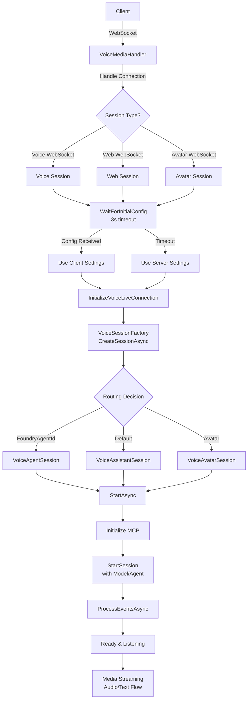

## 2. Flusso Dettagliato della Sessione Voice Assistant

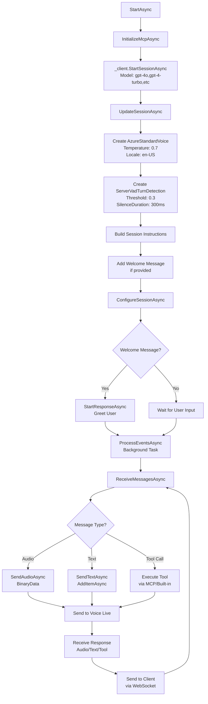

## 3. Flusso delle Connessioni WebSocket

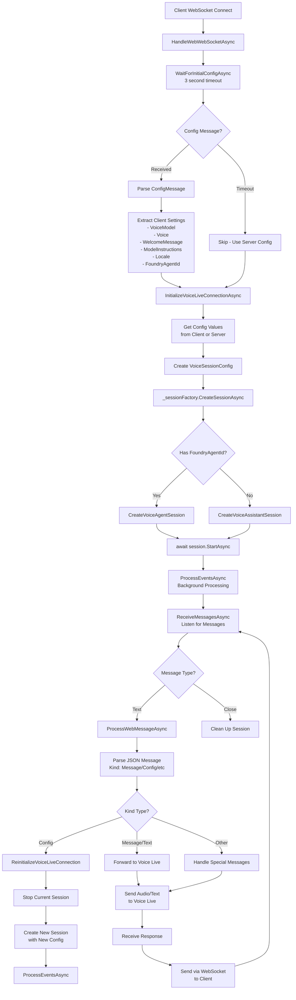

## 4. Flusso di Elaborazione Audio

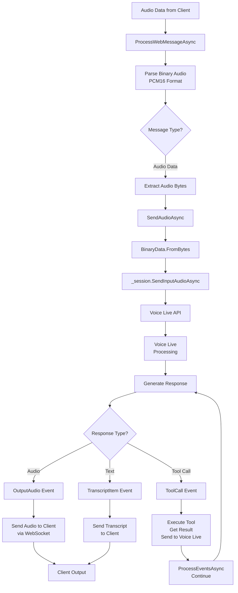

## 5. Flusso dei Messaggi da Client a Voice Live

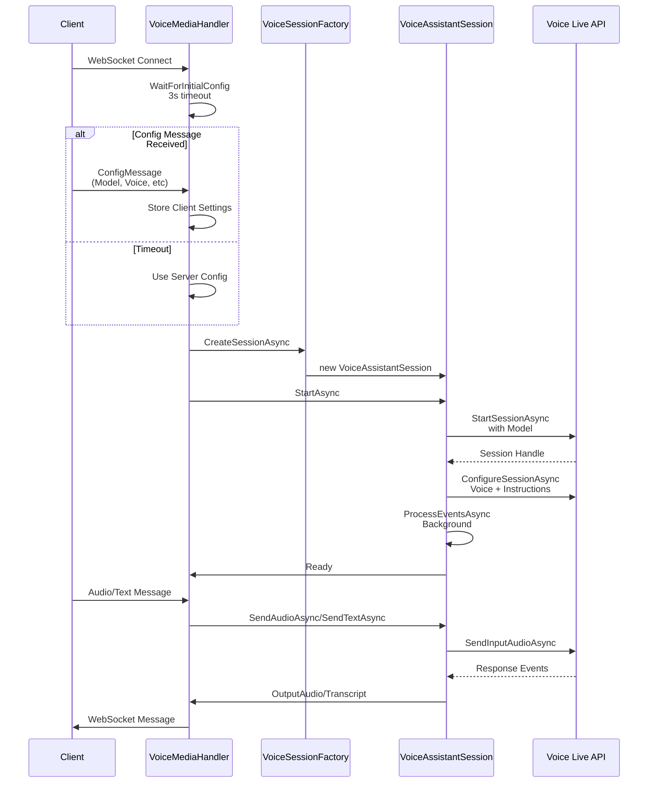

## 6. Flusso di Ricezione Messaggi Voice Live

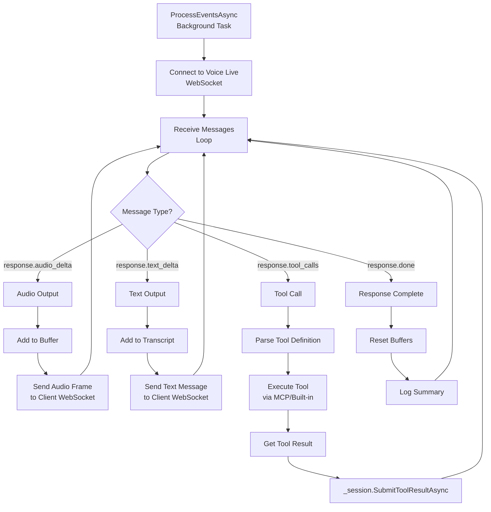

## 7. Flusso Chiamate in Entrata (Incoming Call - ACS)

```mermaid
graph TD
    A["Phone Call Incoming"] --> B["EventGrid Event<br/>ACS"]
    B --> C["IncomingCallHandler<br/>ProcessIncomingCallAsync"]
    
    C --> D["Extract Caller ID<br/>from Event"]
    D --> E["Build Callback URI<br/>for Events"]
    E --> F["Build WebSocket URI<br/>wss://host/acs/ws"]
    
    F --> G["Create MediaStreamingOptions<br/>Audio Channel: Mixed<br/>Format: PCM24KMono<br/>Bidirectional: true"]
    
    G --> H["AnswerCallOptions<br/>with Streaming Config"]
    H --> I["_acsClient.AnswerCallAsync"]
    
    I --> J["Call Answered<br/>Media Streaming Started"]
    
    J --> K["EventGrid Callback<br/>CallConnected Event"]
    K --> L["ProcessCallbackEventsAsync"]
    
    L --> M["HandleCallConnectedAsync<br/>Log Connection Details"]
    M --> N["MediaStreamingStarted<br/>Event"]
    
    N --> O["VoiceMediaHandler<br/>HandleWebWebSocketAsync<br/>Raw Audio Mode"]
    
    O --> P["WaitForInitialConfig<br/>Timeout expected<br/>Use Server Config"]
    P --> Q["Create Voice Session<br/>with Phone Settings"]
    
    Q --> R["Exchange Audio<br/>Phone ↔ Voice Live"]
    R --> S["End Call"]
    S --> T["MediaStreamingStopped<br/>Event"]
```

## 8. Flusso Avatar (con WebRTC)

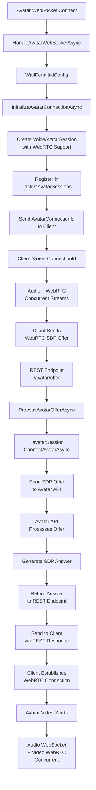

## 9. Stato e Transizioni delle Sessioni

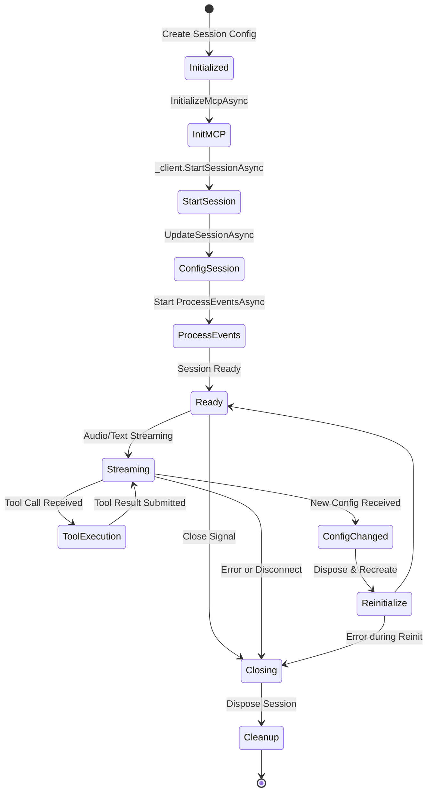

## 10. Struttura dei Messaggi WebSocket

### Client → Server (Config Message)
```json
{
  "kind": "Config",
  "voiceModel": "gpt-4o",
  "voice": "en-US-AvaNeural",
  "welcomeMessage": "Hello, how can I help?",
  "voiceModelInstructions": "You are a helpful assistant...",
  "locale": "en-US",
  "foundryAgentId": "optional-agent-id",
  "foundryProjectName": "optional-project-name",
  "voiceLiveEndpoint": "optional-endpoint",
  "voiceLiveApiKey": "optional-api-key"
}
```

### Server → Client (Message Response)
```json
{
  "kind": "Message",
  "type": "output_audio",
  "data": "base64-encoded-audio"
}
```

```json
{
  "kind": "Message",
  "type": "transcript",
  "data": "Transcribed text from user"
}
```

### Server → Client (Session Event)
```json
{
  "kind": "SessionEvent",
  "event": "AvatarConnectionId",
  "payload": {
    "connectionId": "uuid-string"
  }
}
```

## Componenti Chiave

| Componente | Ruolo | Responsabilità |
|-----------|-------|-----------------|
| **VoiceMediaHandler** | Media Hub | Gestisce WebSocket client, routing messaggi, streaming audio |
| **VoiceSessionFactory** | Factory Pattern | Crea sessioni appropriate (Assistant/Agent/Avatar) |
| **VoiceAssistantSession** | Model-based | Parla con GPT-4 direttamente |
| **VoiceAgentSession** | Foundry Agent | Integrazione con Azure Agent Service |
| **VoiceAvatarSession** | Avatar + WebRTC | Avatar visivo con streaming audio/video |
| **IncomingCallHandler** | ACS Integration | Gestisce chiamate telefoniche in entrata |
| **VoiceSessionBase** | Base Class | Logica comune: MCP, event processing, tool execution |

## Modalità di Operazione

### 1. **Web Client Mode**
- Client JavaScript → Raw Audio PCM16
- Optional: Config message con parametri custom
- Supporta: Voice Assistant, Voice Agent, Avatar

### 2. **Incoming Call Mode (ACS)**
- Chiamata telefonica → ACS → WebSocket audio
- Usa configurazione server (no Config message)
- Supporta: Voice Assistant, Voice Agent
- Audio: 24kHz mono PCM

### 3. **Avatar Mode**
- WebRTC per video avatar
- WebSocket per audio
- Connessioni concorrenti
- SDP exchange via REST endpoint

## Sequenza Tipica di Sessione

1. **Connessione**: Client stabilisce WebSocket
2. **Config (opzionale)**: Client invia parametri
3. **Inizializzazione**: VoiceMediaHandler crea sessione
4. **Avvio**: Session.StartAsync() prepara Voice Live
5. **Benvenuto**: Welcome message se configurato
6. **Streaming**: Scambio audio/testo continuo
7. **Tool Execution**: Esecuzione tool se richiesta
8. **Chiusura**: Cleanup e disconnect

## Flusso di Errore e Recovery

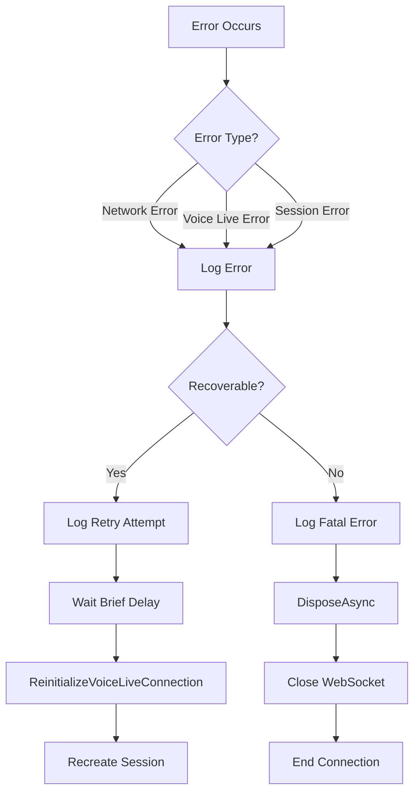

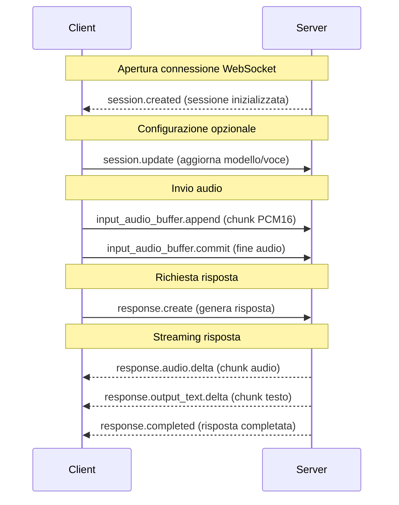